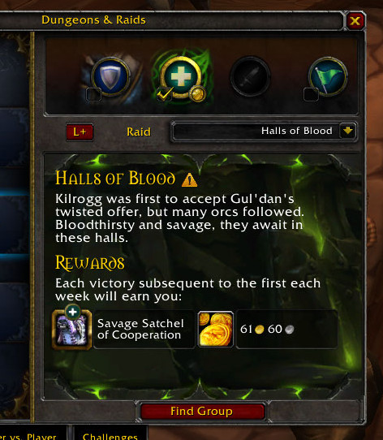
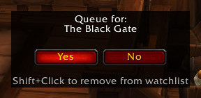

# LookingForSatchels
LookingForSatchels (LFS) lets you select which dungeons you want to do, and tells you when the Call to Arms buff for one of these dungeons is active.

## Quick guide

I installed the addon. What now?

1. Set your role(s) to scan

    Type `/lfs roles x x x` (where `x` is either `0` or `1`) to define if you want to scan for Tank, Heal and/or Damage (in that order). `/lfs roles 0 1 0` for example will scan for Heal only. `/lfs roles 1 0 1` will scan for Tank and Damage, but not for Heal.

2. Select dungeons

    Open the Dungeon Finder window, select the dungeon(s) you want to scan, and press the L+ button for each dungeon to add them to your watch list. When the Raidfinder window is open, you can SHIFT-Click the L+ button to add all Raidfinder wings to the watch list.

3. Select role(s) to queue

    In any Dungeon Finder window select the role(s) you want to queue for. These are not the roles being scanned! You can scan for Tank only, but queue for Tank/Damage.

4. Done

    Sit back and wait for the addon to find a satchel. For more options, like what the "L" in the center of the screen is for, how you can move/hide/interact with it and more, read below!

## General functions

Click the L+ button to add a dungeon to your watch list; click again to remove it. (Shift-Click to add all Raidfinder wings to your watch list, Ctrl-Click to remove all Raidfinder wings from the list)

Whenever you have a dungeon selected LFS will tell you when the Call to Arms buff is active, so you can get the most out of random queuing. The addon will throw a Raid Warning, write a line to chat, flash the Windows Taskbar, and play a sound.

Ingame you have the option to show a one-click-queue popup which lets you queue for a dungeon without needing to click through the Blizzard UI to find the right dungeon. For now, this will queue you using the roles set in the group finder.

## Command Options
`/lfs` for command options.

`/lfs roles <tank> <heal> <damage>` Replace the roles with `0`s and `1`s, `1` meaning the addon will search for that role.

Example: `/lfs roles 1 0 1` will tell you when you get a special reward for tanking or dealing damage, but will ignore rewards for healers.

`/lfs move` to move the search indicator around. Red: No dungeon selected. Yellow: Searching. Green: Satchel found. Grey: Scanning paused.

`/lfs hide` if you want to hide the indicator (`/lfs show` to show it again).

To change the sound file enter `/lfs sound`, followed by the sound name:

`/lfs sound LOOTWINDOWCOINSOUND`

This will change the sound to `LOOTWINDOWCOINSOUND`. See [this link](http://wowwiki.wikia.com/wiki/API_PlaySound) for available sound files.

`/lfs togglescan` or shift+click on the search indicator: quickly toggle scanning on/off

`/lfs first` toggle whether require first-run (valor) reward, to ignore a satchel when you already completed that dungeon/raid finder wing this day/week.

## Search Indicator Options

The "L" in the center of the screen is a status indicator and shows what the addon is doing at the moment.

Red color: No dungeon selected. Yellow color: Searching. Green color: Satchel found. Grey color: Scanning paused.

Shift+Left-Click: toggle scanning

Control+Left-Click: clear watch list

Right-Click: Rescan all instances. Useful if you dismissed a popup window by accident.

---

Go ahead, tab out of the game, watch [your favourite YouTube video](https://www.youtube.com/watch?v=J---aiyznGQ) and get back when it's time to grab the monies!

---

Future plans:

integrate the indicator functionality into a Minimap button,
separate roles per dungeon (e.g. search for Tank-satchel in Random Heroic Dungeon and Heal-satchel in RaidFinder),
add roles to one-click-queue popup (mirror the dungeon finder's behaviour, to check and change the roles you want to queue for)
